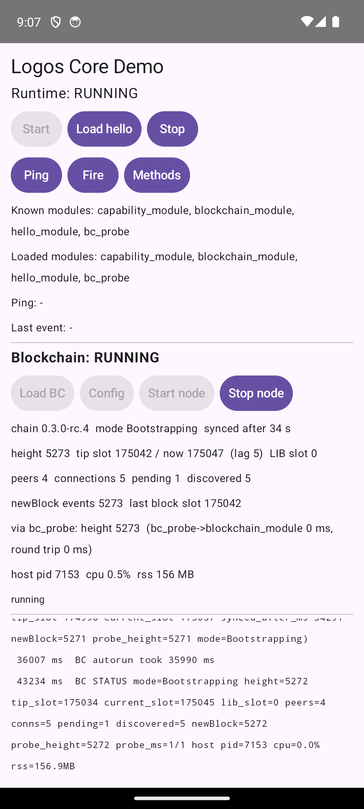

# Building and running the Android wrapper

How to go from an empty `build/` to the demo app running liblogos on the x86_64 API 34
emulator, with the plan's M4 acceptance check passing. Every step is a script in
[`scripts/android/`](../scripts/android). Each script starts with a comment block giving its
inputs, outputs and pinned versions (`bash <script> --help` prints it). Each one can be
re-run: a step whose outputs exist is skipped unless `FORCE=1`. Full logs go to
`build/logs/<script>-<abi>.log`. The terminal shows only progress lines, plus the last 40
log lines on failure.

What runs where (the reasons are in [`plan.md`](plan.md) and
[`investigation.md`](investigation.md)):

```
app process (com.fryorcraken.logoslib.demo, untrusted_app)
  Kotlin LogosCore  --JNI-->  liblogos_jni.so
                               |- thread "logos-qt": QCoreApplication + logos_core_start + exec()
                               |- liblogos_core.so, liblogos_protocol.so (lp_* calls, events)
                               '- Qt6Core/Network/RemoteObjects, OpenSSL, liblgx, ...
  |  posix_spawn(nativeLibraryDir/liblogos_host_qt.so), one child per module,
  |  QtRO over unix sockets in cacheDir, working directory filesDir/work
  |- liblogos_host_qt.so --name capability_module ...   (started by logos_core_start)
  |- liblogos_host_qt.so --name hello_module ...        (started by loadModule)
  |- liblogos_host_qt.so --name blockchain_module ...   (M5: the Logos blockchain node, a Rust
  |                                                       library, runs inside this child)
  '- liblogos_host_qt.so --name bc_probe ...            (M6: calls blockchain_module through liblogos)
```

## Prerequisites

| What | Version used here | Where the scripts look |
| --- | --- | --- |
| Linux x86_64 host | Fedora 43, 16 cores | about 6 GB free disk for `build/` and Qt |
| Host tools | cmake 3.31 (3.21 or later), GNU make, perl, python3 with venv, curl, git, tar, bzip2, xz, sha256sum, unzip, a host C++17 compiler (gcc) | `PATH`. Ninja is not needed: CMake uses "Unix Makefiles" |
| Android NDK | r27c (27.2.12479018) | `ANDROID_NDK_HOME`, default `~/android-ndk/android-ndk-r27c` |
| Android SDK | platform-tools 37.0.1, emulator 37.1.11, build-tools 36/37, platform android-37 (compileSdk 37) | `ANDROID_SDK_ROOT`, default `~/android-sdk` |
| System image and AVD | `system-images;android-34;google_apis;x86_64`, AVD `delivery-demo` | `EMU_AVD`, default `delivery-demo` |
| JDK | 21 (17 or later works) | `JAVA_HOME`, default `/usr/lib/jvm/java-21-openjdk` |
| Qt | 6.11.1 official prebuilts: `android_x86_64`, `android_arm64_v8a`, `gcc_64` (installed by step 1) | `QT_ROOT`, default `.work/probe/qt/6.11.1` |
| Network | GitHub, archives.boost.io, download.libsodium.org, pypi.org and the Qt mirrors (first run only); Google Maven and Maven Central (Gradle) | |

Gradle 9.7.1 comes from the wrapper in `android/`, and AGP 9.4.0 and the AndroidX libraries
come from Maven. All other pins are in
[`scripts/android/versions.env`](../scripts/android/versions.env) and
[`android/gradle/libs.versions.toml`](../android/gradle/libs.versions.toml).

To create an AVD if you have none (standard SDK commands; not run here, because this host
already has `delivery-demo`):

```sh
sdkmanager "system-images;android-34;google_apis;x86_64" "emulator" "platform-tools"
avdmanager create avd -n logos-api34 -k "system-images;android-34;google_apis;x86_64" -d pixel_6
export EMU_AVD=logos-api34
```

## Build and run, in order

Run from the repository root. Times are from this host with sources not yet fetched.

```sh
bash scripts/android/install-qt.sh x86_64        # 1. Qt 6.11.1 android_x86_64 + gcc_64 (aqtinstall 3.3.0)
bash scripts/android/build-deps.sh x86_64        # 2. M2 prefix: Boost, OpenSSL, libsodium, liblgx, ...  ~2-3 min
bash scripts/android/build-runtime.sh x86_64     # 3. M3 runtime: liblogos, host, capability_module, hello_module  ~1.5 min
bash scripts/android/build-jni.sh x86_64         # 4. liblogos_jni.so (the JNI shim)  ~1 s
bash scripts/android/stage.sh x86_64 capability_module hello_module   # 5. into :logos-core, then checked  ~3 s
bash scripts/android/build-apk.sh x86_64 --unit-tests                 # 6. Gradle: APKs + JVM tests  ~20 s clean
bash scripts/android/emulator.sh start           # 7. boot emulator-5570  ~20-60 s
bash scripts/android/run-m4.sh x86_64            # 8. M4 acceptance  ~30 s
bash scripts/android/emulator.sh stop            # 9.
```

For M5/M6, the blockchain node and its modules come between steps 3 and 4, and step 5 stages
them too (details in [`blockchain-android.md`](blockchain-android.md)):

```sh
bash scripts/android/build-blockchain.sh x86_64         # liblogos_blockchain.so  ~11 min cold
bash scripts/android/build-libfyaml.sh x86_64           # libfyaml.so  seconds
bash scripts/android/build-blockchain-module.sh x86_64  # blockchain_module + bc_probe  ~25 s
bash scripts/android/stage.sh x86_64 capability_module hello_module blockchain_module bc_probe
```

and `run-m5.sh` runs after (or instead of) `run-m4.sh`; see "M5/M6" below.

### What each step prints when it works

1. **`install-qt.sh`** creates `.work/probe/qt-venv` with aqtinstall 3.3.0. It then runs
   `aqt install-qt all_os android 6.11.1 android_x86_64 --archives qtbase -m qtremoteobjects`
   and `aqt install-qt linux desktop 6.11.1 linux_gcc_64 --archives qtbase icu -m qtremoteobjects`.
   `all` also installs `android_arm64_v8a`. Last lines:
   ```
   -- android_x86_64: OK (96M)
   -- gcc_64: OK (176M)
   install-qt: OK (.../.work/probe/qt/6.11.1: android_x86_64 gcc_64)
   ```
2. **`build-deps.sh`** builds ten steps: boost, fmt, spdlog, json, cli11, semver, openssl,
   sodium, lgx and lpm. Then `check-prefix.sh` checks the prefix: `lib*.so` SONAMEs, NEEDED,
   16 KB LOAD alignment, undefined symbols, no glibc and no `/nix/store`.
   ```
   check-prefix: OK -- 14 files checked, no violations
   build-deps: OK (x86_64) ...
   ```
3. **`build-runtime.sh`** builds fifteen steps: gen (the host code generators), cppsdk,
   protocol, qthost, qtsdk, module, modulehost, procstats, container, subprocess, loader,
   loaderqt, liblogos, capability and hello. The upstream repos are checked out at the
   `db45024` closure under `build/src/`, with `patches/` applied.
   ```
   check-prefix: OK -- 20 files and 2 module manifests checked, no violations
   build-runtime: OK (x86_64) ...
   ```
4. **`build-jni.sh`**:
   ```
   -- .../build/android/x86_64/jni/liblogos_jni.so: 1102368 bytes, SONAME liblogos_jni.so, LOAD align 0x4000
   -- NEEDED: liblogos_core.so liblogos_protocol.so libQt6Core_x86_64.so liblog.so libdl.so libm.so libc++_shared.so libc.so
   -- exports: JNI_OnLoad + 20 LogosNative entry points
   build-jni: OK (...)
   ```
5. **`stage.sh`** copies and strips the DT_NEEDED closure into
   `android/logos-core/src/main/jniLibs/x86_64/`, and the module directories into
   `android/logos-core/src/main/modules-staged/x86_64/`. Both are gitignored. It then runs
   `check-prefix.sh` on exactly that set. Name the modules: without arguments it stages every
   module under `build/android/x86_64/modules/`, which includes `blockchain_module` (about
   87 MB more in the APK's assets) once `build-blockchain-module.sh` has run. A module's
   private libraries stay in its directory, and a module whose `dependencies` are not staged
   is refused.
   ```
   -- staged 15 libraries into android/logos-core/src/main/jniLibs/x86_64 (24416512 bytes, strip=1)
   -- staged modules capability_module hello_module into ... (stamp d1b29f001d22c5aa)
   stage: OK -- 15 libraries (24416512 bytes) + 2 modules; list in build/android/x86_64/staged.txt
   ```
6. **`build-apk.sh`** runs `gradlew :demo-app:assembleDebug :demo-app:assembleDebugAndroidTest`
   with `-Plogos.abis=x86_64`, plus `:logos-core:testDebugUnitTest` with `--unit-tests`. It
   refuses an APK that lacks the runtime or the modules, and writes
   `build/android/x86_64/apk-sizes.txt`.
   ```
   -- name="com.fryorcraken.logoslib.core.FirstCallRetryTest" tests="7" ... failures="0" errors="0"
   -- name="com.fryorcraken.logoslib.core.LogosJsonTest" tests="10" ...
   -- name="com.fryorcraken.logoslib.core.internal.RuntimeEnvTest" tests="8" ...
      native libraries lib/                        24427272      9787610  (16 files)
      module assets assets/modules/                 4830874      1750612  (7 files)
   -- demo-app-debug.apk: 41033524 bytes; test APK 867443 bytes; ...
   build-apk: OK (.../demo-app-debug.apk)
   ```
7. **`emulator.sh start`** starts
   `emulator -avd delivery-demo -read-only -port 5570 -no-audio -no-boot-anim -no-snapshot-save -qt-hide-window`
   detached, waits for `sys.boot_completed`, and turns the screen on and unlocks it. It
   refuses to start a second emulator.
   ```
   -- emulator-5570 booted in 22 s
   -- emulator-5570: API 34, ABIs x86_64,arm64-v8a, page size 4096, SELinux Enforcing
   emulator: OK (emulator-5570)
   ```
8. **`run-m4.sh`** runs four phases; name some to run only those:
   `install`, `test` (`connectedDebugAndroidTest`), `demo` (autorun, `ps`, UI dump,
   screenshot, a "Methods" tap and a "Stop" tap) and `kill` (autorun, then `am force-stop`).
   It prints one PASS/FAIL line per check and exits non-zero if any fails.
   ```
   [PASS] instrumented test -- LogosCoreAcceptanceTest: 7 tests, 0 failures, 0 errors (Gradle rc=0)
   ...
   [PASS] 7b no child survives am force-stop -- before: 2 children of pid 8386; after: no liblogos_host_qt.so and no com.fryorcraken.logoslib.demo process
   run-m4: OK (18 checks passed)
   ```
   The evidence goes to `build/android/x86_64/m4/`: `summary.txt`, full and excerpted
   logcat per phase, `ps-*.txt`, `ui-*.xml`, `gfxinfo.txt`, the JUnit XML and
   `timings.txt`. Screenshots go to `build/screenshots/m4.png` (after autorun) and
   `m4-stopped.png` (after Stop).
9. **`emulator.sh stop`** runs `adb -s emulator-5570 emu kill` and waits until no qemu
   process is left for port 5570.

The steps for arm64-v8a are the same with `arm64-v8a` in place of `x86_64`. For an APK
carrying both ABIs, stage both and pass `GRADLE_ARGS=-Plogos.abis=x86_64,arm64-v8a`. arm64
builds and passes every static check, but it has not run on a device: the arm64 AVD does not
boot on this host.

### By hand

```sh
cd android
export JAVA_HOME=/usr/lib/jvm/java-21-openjdk ANDROID_HOME=$HOME/android-sdk
./gradlew :demo-app:assembleDebug :demo-app:assembleDebugAndroidTest
ANDROID_SERIAL=emulator-5570 ./gradlew :demo-app:connectedDebugAndroidTest   # uninstalls the app afterwards
adb -s emulator-5570 install -r -t demo-app/build/outputs/apk/debug/demo-app-debug.apk
adb -s emulator-5570 shell am start -n com.fryorcraken.logoslib.demo/.MainActivity --ez autorun true
adb -s emulator-5570 logcat -s LogosDemo LogosCore logos-jni logos-qtloop logos-stdio
adb -s emulator-5570 shell ps -A -o PID,PPID,USER,NAME,ARGS | grep -E 'logoslib|liblogos_host_qt'
adb -s emulator-5570 exec-out screencap -p > build/screenshots/m4.png
```

Autorun runs start, load hello_module, subscribe, ping and fire, then waits for the event,
and ends with `AUTORUN OK (ping=pong, event=tag-1)` under tag `LogosDemo`. Without the
extra, the same sequence is driven by the Start, Load hello, Ping and Fire buttons.

## M4 result (2026-09-25, x86_64 API 34 emulator)

`run-m4.sh`: 18/18 checks passed. It was run four times in full, the last on a freshly booted
emulator; five more runs of the test phase and three more of the force-stop phase also
passed.

| # | Acceptance item | Evidence |
| --- | --- | --- |
| 1 | liblogos_core starts in the app process; capability_module comes up in a `liblogos_host_qt.so` child | `logos-qtloop: logos_core_start() returned` from the app pid; `logos-stdio: [info] [logos] Module loaded: capability_module`; `ps`: `liblogos_host_qt.so --name capability_module ... --host-services token_registry,token_delivery --token-source stdin`, PPID = the app, `untrusted_app` |
| 2 | `knownModules()` lists hello_module | `known modules: [hello_module, capability_module]` |
| 3 | `loadModule("hello_module")` is true and a second child appears | `loadModule(hello_module) -> true`; `ps` shows the second child `--name hello_module`; the instrumented test finds both in `/proc` |
| 4 | `call("hello_module","ping")` returns `"pong"` | `ping -> "pong"`, on the first attempt in every run |
| 5 | An event reaches Kotlin | `event hello_module.hello ["tag-1"]`; the test checks its own tag within 5 s |
| 6 | The UI stays responsive | no ANR; no Choreographer "Skipped frames" on the main thread; a Methods tap is answered in 20-25 ms (in-app); the UI dump shows `Runtime: RUNNING`, `Ping: pong`, `Last event: tag-1` |
| 7 | `stop()` tears down cleanly; nothing survives `am force-stop` | Stop tap: `stopped: true`, the app pid is unchanged and 0 children remain (the test also asserts 0 children after `stop()`); `am force-stop` with 2 children: app and hosts gone within 50-106 ms |

`ps -A` while the demo runs (RSS in KB):

```
  PID  PPID USER     LABEL                                      RSS NAME
 4516   364 u0_a193  u:r:untrusted_app:s0:c193,c256,c512,c768 163972 com.fryorcraken.logoslib.demo
 4547  4516 u0_a193  u:r:untrusted_app:s0:c193,c256,c512,c768  13200 liblogos_host_qt.so --name capability_module --path .../files/modules/capability_module/capability_module_plugin.so ...
 4555  4516 u0_a193  u:r:untrusted_app:s0:c193,c256,c512,c768  14400 liblogos_host_qt.so --name hello_module --path .../files/modules/hello_module/hello_module_plugin.so ...
```

Timings, in-app, device clock:

| Operation | Time |
| --- | --- |
| `start()`: env, module extraction, `loadLibrary`, QCoreApplication, `logos_core_start` including the capability_module child | 46-88 ms (342 ms on the first launch after emulator boot) |
| `loadModule(hello_module)` (spawns the host) | 15-21 ms (`logos_core_load_module` alone: 38-39 ms in the demo) |
| First `ping` after load | 3-5 ms, 1 attempt; the first-call race never showed |
| Warm `ping` | 1-2 ms |
| subscribe to `ARMED` | 1 ms |
| `fire` to event in Kotlin | 2-4 ms |
| `stop()` (loop quit, lp teardown, `logos_core_cleanup`, children gone) | 101-109 ms |
| APK install (both) / activity launch (`am start -W`) | 0.4-2.5 s / 0.5-1.2 s |
| `connectedDebugAndroidTest` wall time (Gradle) | 11-14 s |

APK size (x86_64 debug, `unzip -v`; full list in `build/android/x86_64/apk-sizes.txt`):

| Entry | Uncompressed | Stored in APK |
| --- | ---: | ---: |
| `libQt6Core_x86_64.so` | 6,420,704 | 2,630,441 |
| `libcrypto_3.so` | 5,970,552 | 2,312,506 |
| `liblogos_protocol.so` | 2,146,880 | 781,257 |
| `libQt6Network_x86_64.so` | 1,820,568 | 749,330 |
| `liblogos_host_qt.so` (the host executable) | 1,401,120 | 603,803 |
| `libc++_shared.so` | 1,252,080 | 459,698 |
| `libssl_3.so` | 1,036,552 | 475,461 |
| `libQt6RemoteObjects_x86_64.so` | 963,888 | 356,035 |
| `liblgx.so` | 963,176 | 465,548 |
| `liblogos_core.so` | 890,160 | 353,122 |
| `libpackage_manager_lib.so` | 535,584 | 220,947 |
| `libspdlog.so` | 472,272 | 146,101 |
| `liblogos_qt_host.so` | 312,000 | 117,239 |
| `libfmt.so` | 161,208 | 77,241 |
| `liblogos_jni.so` | 69,768 | 34,004 |
| `libandroidx.graphics.path.so` (Compose) | 10,760 | 4,877 |
| **all of `lib/x86_64/`** | **24,427,272** | **9,787,610** |
| `assets/modules/`: capability_module_plugin.so 2,421,624 + hello_module_plugin.so 2,408,624 + manifests | 4,830,874 | 1,750,612 |
| `classes*.dex` (debug build, stored uncompressed) | 28,949,072 | 28,949,072 |
| **demo-app-debug.apk** | | **41,033,524** |

On the device the runtime is extracted to `nativeLibraryDir` (24.4 MB) and the modules to
`filesDir/modules` (4.8 MB). The Logos part of the APK is 11.5 MB compressed. Most of the
41 MB is the debug build's uncompressed dex.

## M5/M6: the blockchain node from the app (2026-09-25, x86_64 API 34 emulator)

The demo app loads `blockchain_module` (logos-blockchain-module 4b07e58 around the Logos
blockchain node, built at tag 0.3.0-rc.4) and `bc_probe`, each in its own
`liblogos_host_qt.so` child. It generates a node config, starts the node as a devnet
0.3.0-rc.4 follower and shows it syncing, and reads the live height through bc_probe, whose
host calls blockchain_module over liblogos' own QtRO transport. Build details and runtime
caveats: [`blockchain-android.md`](blockchain-android.md).

### How to run

```sh
# after steps 1-3 above, and the four M5/M6 build lines
bash scripts/android/build-jni.sh x86_64
bash scripts/android/stage.sh x86_64 capability_module hello_module blockchain_module bc_probe
FORCE=1 bash scripts/android/build-apk.sh x86_64 --unit-tests   # clean build: see "APK size" below
bash scripts/android/emulator.sh start
bash scripts/android/run-m5.sh x86_64        # ~3.5 min; needs UDP to 65.108.203.235:3000-3002
bash scripts/android/run-m4.sh x86_64        # still passes with the 4-module APK
bash scripts/android/emulator.sh stop
```

`run-m5.sh` has four phases (`install demo kill test`; name some to run only those):

- **demo**: `am start ... --ez bc_autorun true --ez bc_fresh true --es log_level debug`, which
  loads both modules, wipes `files/blockchain`, generates the config and starts the node. It
  samples the blockchain host with `top` and `/proc/<pid>/status` every few seconds, taps
  "Load hello" while the node syncs, and waits for `BC AUTORUN OK`. Then it takes a UI dump
  and screenshots, and records meminfo and disk use. Last, it stops the node through
  `--es bc_action stop` and the runtime through the Stop button.
- **kill**: autorun again on the synced directory (so `start()` replays the chain), then
  `am force-stop`.
- **test**: `am instrument -e blockchain 1 -e class ...BlockchainAcceptanceTest`, ten ordered
  tests with their own node directory (`files/blockchain-test`, synced from genesis each run).
  The last one SIGKILLs the blockchain host and checks that `LogosCore` reports it.

Evidence goes to `build/android/x86_64/m5/` (`summary.txt`, logcat per phase,
`top-bc.txt`, `status-lines.txt`, `token-evidence.txt`, `du.txt`, `user_config.yaml`,
`instrument.txt`), screenshots to `build/screenshots/m5-*.png`. Expected end:

```
   [PASS] 4 height reaches the devnet tip -- BC SYNCED height=5271 tip_slot=174998 current_slot=175037 lag=39 slots after 34291 ms since start(); peers=4 newBlock=5271
   ...
   [PASS] instrumented test -- BlockchainAcceptanceTest: OK (10 tests)
run-m5: OK (17 checks passed)
```

By hand, or on a phone:

```sh
adb shell am start -n com.fryorcraken.logoslib.demo/.MainActivity --ez bc_autorun true   # + --ez bc_fresh true
adb logcat -s LogosDemo       # BC load ..., BC config: ..., BC start() returned ..., BC first peer ...,
                              # BC SYNCED ..., BC STATUS ... every 10 s, BC AUTORUN OK (...)
adb shell am start -n com.fryorcraken.logoslib.demo/.MainActivity --es bc_action stop
```

The same steps are buttons in the Blockchain section: Load BC, Config, Start node and Stop
node. Below them are the chain id and mode, height and tip slot against the wall-clock slot,
peers and connections, the newBlock event count, the bc_probe row, and the host's pid, CPU
and RSS. What the demo does, in `demo-app/.../BlockchainNode.kt`:

1. `loadModule("blockchain_module")`, then `loadModule("bc_probe")`, then subscribe to
   `newBlock` (after the load, before `start`).
2. `generate_user_config` with `initial_peers`, `net_port` and `blend_port` from
   `config/blockchain/devnet-rc4-gen-args.json`, which the APK carries as an asset.
   `output`, `state_path`, `storage_path` and `logs_path` are absolute paths under
   `filesDir/blockchain`, and `http_addr` is `127.0.0.1:18080`. `use_persistence_paths` is
   false, because it would move `output` under liblogos' per-instance directory. The
   config is kept across runs: a second `generate_user_config` refuses an existing keystore.
3. `merge_user_config(cfg, cfg, <follower-mode.extra.yaml>, false, false)`. This sets
   `prolonged_bootstrap_period` to 1 year, so the node stays in Bootstrapping and never
   proves.
4. `start(cfg, "")` with a 10 min timeout. The empty deployment is the devnet one compiled
   into the node.
5. Every 2 s: `get_cryptarchia_info`, `get_network_info`, `get_time_info`,
   `bc_probe.chain_info_via_bc` and `moduleStats()`. "At the tip" means the tip's slot is
   within 180 slots (3 min) of `get_time_info`'s current slot.
6. `stop()`, no earlier than 2 s after `start()` returned.

### Result

`run-m5.sh`: 17/17 checks passed in the last two full runs (the final one with the APK
described here). The first full run passed 16 of 17: JUnit's name order put `t10_...`
before `t1_...`, so the host-kill test ran first, and the tests were renamed `t01`-`t10`.

| # | Acceptance item | Evidence (final run unless noted) |
| --- | --- | --- |
| 1 | blockchain_module and bc_probe load, each in its own `liblogos_host_qt.so` child | `BC load blockchain_module + bc_probe -> true in 104 ms; hosts: bc_probe=pid 7157, blockchain_module=pid 7153, capability_module=pid 7149`; `ps`: all three (and hello_module, loaded during the sync) with PPID = the app, `untrusted_app` |
| 2 | The node starts from the app | `generate_user_config -> .../files/blockchain/user_config.yaml; merge_user_config(follower) -> no conflicts; ... prolonged_bootstrap_period: '31536000.000000000' ...`; `BC start() returned after 56 ms`; `chain id 0.3.0-rc.4` |
| 3 | `n_peers` > 0 | `BC first peer after 2119 ms since start(): NetworkInfo(nPeers=4, nConnections=5, nPending=1, nDiscovered=5)` (test: 3 peers after 1.06 s) |
| 4 | The height reaches the devnet tip | `BC SYNCED height=5271 tip_slot=174998 current_slot=175037 lag=39 slots after 34291 ms since start()`; a few seconds later the UI shows `height 5273  tip slot 175042 / now 175047  (lag 5)` (test: synced after 34.2 s) |
| 5 | newBlock events reach Kotlin | first event 5.7 s after `start()`; 5,271 events for 5,271 blocks, none dropped; payload `["{\"block\":\"{\\\"header\\\":{\\\"version\\\":\\\"Bedrock\\\",\\\"parent_block\\\":...,\\\"slot\\\":7571,...` |
| 6 | bc_probe → blockchain_module returns the live height | `AUTORUN OK (... height=5271 ... probe_height=5271)`; UI `via bc_probe: height 5273 (bc_probe->blockchain_module 0 ms, round trip 0 ms)`; `[bc_probe] <- blockchain_module.get_cryptarchia_info {"success":true,"value":"{\"height\":5274,...`. Token: `[bc_probe] Debug: LogosAPIClient: calling requestModule for "blockchain_module"`, `LogosAPIConsumer: requestModule for origin: "bc_probe" target: "blockchain_module"`, then `[capability_module] Debug: ModuleProxy: callRemoteMethod "requestModule"` (`token-evidence.txt`) |
| 7 | The UI stays responsive during the sync | a "Load hello" tap during the sync loaded hello_module (logged about 2 s later, with 2 s logcat polling); no ANR; 1,124 frames, 7.0 % janky, no Choreographer skip |
| 8 | `stop()` and force-stop leave no child | node `stop()` 66 ms (host stays loaded); runtime Stop: `stopped: true`, 0 children; `am force-stop` of a running node: app and 3 hosts gone in 86 ms; the test's runtime stop: 0 children |



The instrumented test (`BlockchainAcceptanceTest`, 10 tests, 34 s) checks the same things
from inside the app process. It also checks that the blockchain host's `/proc/<pid>/cwd` is
`files/work`, and that a SIGKILLed host is reported: `ModuleExit(blockchain_module,
lastPid=...)` 219-553 ms after the kill (the watchdog polls every second), and the next
call fails in 0 ms with `LogosModuleDiedException`.

Before the DNS patch (`patches/logos-blockchain/logos-blockchain-02-*`), the node panicked
14 ms into `start()` (no `/etc/resolv.conf`) and its host exited. LogosCore failed the
`start()` call 0.8 s later with `LogosModuleDiedException`, and the app, capability_module
and bc_probe kept running (`.work/logs/m5-run/probe1-unpatched-*`).

**Stretch: the offline standalone chain.** The node repo's standalone config pair (Android
paths) was started from the demo (`--es bc_config ... --es bc_deployment ...`). It went
Online and proposed a block every 1 s slot, each with a PoL Groth16 proof made on the
device: height 11 after 22 s, at 84-89 % of one core
(`.work/scripts/m5-run-standalone.sh`, `build/screenshots/m5-standalone.png`). Devnet
worked, so this fallback was not needed for acceptance.

### Measurements

| What | Measured |
| --- | --- |
| Devnet sync from genesis (5.25k-5.28k blocks) | first peer 1.1-2.2 s after `start()`, first `newBlock` 5.7 s, at the tip after 32.2-37.9 s (7 runs: demo and test); about 150 blocks/s |
| `start()` | 46-93 ms on an empty node directory; 20.7-20.8 s on the synced one (replays the chain, since LIB stays at genesis in follower mode) |
| `stop()` (node) | 53-76 ms |
| Blockchain host CPU (`top`, 4 vCPUs) | about 100-120 % of one core for most of the sync (samples 51-121 %), 29.3 s CPU for the whole sync; 0-1 % following the head |
| Blockchain host memory (`/proc/<pid>/status`) | 53-58 MB RSS at `start()`, 105-165 MB while syncing, 157-160 MB following; VmHWM 178-179 MB; 14-15 threads |
| Other processes | app 167-176 MB RSS; capability_module and bc_probe hosts 15-17 MB each, hello_module 13 MB |
| Disk under `filesDir` | `blockchain/` 46.8 MB (RocksDB `db/` 46.7 MB, `logs/` 56 KB) after 5.27k blocks; `modules/` 96,176 KB; `work/` empty |
| bc_probe hop | `bc_probe -> blockchain_module` 0-1 ms (up to 10 ms mid-sync); Kotlin round trip 0-3 ms idle, up to 32 ms mid-sync |
| First launch after install (asset extraction) | runtime `start()` 587-683 ms with extraction, 57 ms without; about 0.55-0.63 s of extraction (969 ms against 101 ms at M5-build) |
| Install | `adb install -r -t` of both APKs 0.6-0.7 s |

APK size (x86_64 debug, clean build: 91,960,288 bytes), the blockchain part:

| Entry | Uncompressed | Stored in APK |
| --- | ---: | ---: |
| `assets/.../blockchain_module/liblogos_blockchain.so` | 87,148,912 | 48,491,506 |
| `assets/.../blockchain_module/blockchain_module_plugin.so` | 2,837,736 | 1,033,862 |
| `assets/.../bc_probe/bc_probe_plugin.so` | 2,885,232 | 969,949 |
| `assets/.../blockchain_module/libfyaml.so` | 627,528 | 290,049 |
| `lib/x86_64/` (unchanged runtime, 16 files) | 24,428,632 | 9,788,131 |
| all module assets (4 modules) | 98,330,922 | 52,536,288 |

The jniLibs set is the M4 one (`liblogos_jni.so` is now 71,128 / 34,525), and the config
fixtures add a few KB. An incremental Gradle build that replaces the 48 MB entry left the
old copy as dead space once (a 140.5 MB APK); `FORCE=1 build-apk.sh` builds clean.

### Caveats seen

- **DNS:** the node needs `patches/logos-blockchain/logos-blockchain-02-*` to start at all
  on Android (see the table above). NTP works unpatched, and so does the gateway monitor,
  which only warns. The app needs the `INTERNET` permission.
- **Working directory:** `LogosCore` `chdir()`s the app to `filesDir/work`, which the hosts
  inherit. The node never wrote `MyLogFile.log` there, not even while proving.
- **Restart cost:** in follower mode LIB stays at genesis, so every restart replays the whole
  chain (21 s for 5.27k blocks here, and growing).
- **Logs:** the node's own lines reach `logos-stdio` with ANSI colour codes, about 150 lines
  per sync. `--es log_level debug` (`LOGOS_LOG_LEVEL`) adds several lines per call from every
  host.
- **CPU figures:** `logos_core_get_module_stats()` reports kernel time only (process-stats
  bug, `patches/process-stats/`, a proposal); `LogosCore.moduleStats()` re-reads
  `/proc/<pid>/stat`, and matches `top` (92-118 % against 84-117 % mid-sync).
- **Emulator network:** the udp/50001 bootstrap peer never answers the QUIC handshake, and
  UDP segmentation offload fails once (`quinn_udp: sendmsg error ... code: 5`). Neither
  stops the sync.

## Troubleshooting

**The emulator crashes at boot with `-no-window`.** On this host
`emulator -no-window` (with or without `-gpu swiftshader_indirect`) SIGSEGVs during cold boot,
right after "Failed to load snapshot default_boot". `emulator.sh` uses the windowed binary
with its window hidden (`-qt-hide-window`). Screenshots still work. `-read-only` lets the
instance share the AVD with another session without writing to it, and the fixed
`-port 5570` keeps it off the default `emulator-5554`. See
[`research/exp-qt-jvmless.md`](research/exp-qt-jvmless.md) ("Emulator").

**`emulator.sh start` says another emulator is running.** Only one emulator may run on this
host. Stop the other one, or use it through `ANDROID_SERIAL=<serial> bash scripts/android/run-m4.sh`.

**`emulator.sh start` times out.** Look at `build/logs/emulator-console.log`. The script
gives up after `EMU_BOOT_TIMEOUT` (300 s); a loaded host can need more. After a failed start,
run `emulator.sh stop` so no half-started qemu is left behind.

**Gradle: "JAVA_HOME ... is not a JDK" or "Unsupported class file".** `/usr/bin/java` on this
host is a JRE-only JDK 25. The scripts default to `JAVA_HOME=/usr/lib/jvm/java-21-openjdk`.

**`build-apk.sh`: "nothing staged for x86_64".** Run `build-jni.sh` and `stage.sh` first.
Gradle does not build native code. Without staging it still builds an APK, whose
`LogosCore.start()` then fails with `IllegalStateException: native runtime not packaged
for x86_64: missing [...]`.

**The app is gone after `connectedDebugAndroidTest`.** AGP uninstalls the app and the test
APK after the run. `run-m4.sh` passes
`-Pandroid.injected.androidTest.leaveApksInstalledAfterRun=true`, and its demo and kill phases
reinstall the app if it is missing.

**`UnsatisfiedLinkError: JNI_ERR returned from JNI_OnLoad`.** A library that links QtCore was
`System.loadLibrary`'d directly, so ART found QtCore's own `JNI_OnLoad`. That call fails
without `Qt6Android.jar`. Load only `c++_shared`, `crypto_3`, `ssl_3` and `logos_jni` (see
`NativeLibs.kt`). `liblogos_jni.so` has its own `JNI_OnLoad`, which primes QtCore with the
real JavaVM.

**SIGSEGV in `QCoreApplication::QCoreApplication` (app or host).**
- In the app, QtCore never got the JavaVM: `logos-qtloop: QtCore JNI_OnLoad(realVM) ... returned -1`
  must appear before `QCoreApplication created`.
- In a `liblogos_host_qt.so` child, the host was built without
  `patches/logos-module-loader-qt/*nojvm-shim.patch`. Check the `loaderqt` step of
  `build-runtime.sh`.

**A module never loads or QtRO cannot listen.**
- TMPDIR must be set and short. The socket is `$TMPDIR/logos_<module>_<12 chars>` and must fit
  the 108-byte `sun_path`. `LogosCore` sets TMPDIR to `cacheDir` and refuses a module name
  that would not fit.
- The host must be found: `LOGOS_HOST_PATH` is set to `nativeLibraryDir/liblogos_host_qt.so`,
  which only exists with `useLegacyPackaging = true` (`extractNativeLibs=true`; `build-apk.sh`
  checks it).

**`knownModules()` lacks a module.**
- The manifest's `main` must have a key liblgx accepts under bionic: `linux-x86_64-dev`,
  not `android-*`, unless `patches/logos-package/0003` is applied.
- The directory name must equal the manifest `name`, and must not start with `_` or `.`,
  because aapt drops those from the APK.
- `check-prefix.sh` checks all three.
- The extracted copy is refreshed when `modules.stamp`, the APK version or the module set
  changes. `adb shell pm clear com.fryorcraken.logoslib.demo` forces it.

**The blockchain host dies right after `start()`, with `A panic occurred: ... ResolveError ...
NotFound ... swarm/mod.rs:86`.** The node library was built without
`patches/logos-blockchain/logos-blockchain-02-android-dns-resolver-fallback.diff` (Android
has no `/etc/resolv.conf`). Re-run `build-blockchain.sh`, `build-blockchain-module.sh` and
`stage.sh`. In the app this shows as `LogosModuleDiedException ... blockchain_module.start
abandoned`.

**The node never gets peers.** The app needs `<uses-permission android:name="android.permission.INTERNET"/>`
(the demo declares it; `:logos-core` does not), and the emulator needs outbound UDP to
65.108.203.235 ports 3000-3002.

**The APK is 48 MB bigger than its entries.** An incremental Gradle build that replaces
the 48 MB `liblogos_blockchain.so` entry can leave the old copy as dead space in the zip.
`FORCE=1 bash scripts/android/build-apk.sh x86_64` builds clean.

**`BlockchainAcceptanceTest` is skipped.** It runs only with the instrumentation argument
`-e blockchain 1` (`run-m5.sh` passes it), and only in an instrumentation process of its
own, because the runtime cannot be restarted once another class stopped it.
`connectedDebugAndroidTest` (and so `run-m4.sh`) skips it.

**`stop()` then `start()` fails with "cannot be restarted in the same process".** This is
expected. Qt allows one QCoreApplication per process, and liblogos keeps global state. Restart
the app, as the demo says.

**Logcat noise that is expected:**
- `F QtCore: initJNI failed` in the app and in every host, and one
  `ClassNotFoundException ... QtNative` in the app. QtCore's `JNI_OnLoad` returns JNI_ERR
  without `Qt6Android.jar`, after storing the VM (the hosts get a fake one). The F-level line
  does not abort.
- `[critical] [capability_module] Critical: Failed to register natives methods for
  org/qtproject/qt/android/QtInputDelegate` in each host, from the same cause.
- `Warning: It is recommended to use 'localabstract' over 'local' on Android` (QtRO).
  `local:` sockets in `cacheDir` work.
- `avc: denied { search } for name="tests" ... shell_test_data_file` (4 per host). This is
  the dynamic linker probing a test directory, with no effect.
- `avc: granted { execute } ... files/modules/<m>/<m>_plugin.so`. This is an audit record,
  not a denial: dlopen of a module plugin from app data is allowed at targetSdk 36 but
  audited (see the limits below).
- `logos-stdio: s_glBindAttribLocation: ...`. The app's stdout is piped to logcat, and the
  emulator's GL driver prints there.

**adb server restarts.** `/usr/bin/adb` (37.0.0) and the SDK's `platform-tools/adb`
(37.0.1) speak the same protocol, but mixing clients of different versions can restart the
server under other sessions. The scripts use the SDK's adb; override with `ADB=...`.

**Two ABIs at once.** `build/src` is shared between ABIs: never run two `build-deps.sh` or
`build-runtime.sh` jobs at the same time.

## Known limits

- **Only x86_64 has run on a device.** arm64-v8a builds and passes the static checks.
  16 KB-page devices and API 35/36 are untested, although every LOAD segment is 16 KB-aligned.
- **Module plugins are `dlopen`ed from `filesDir`.** SELinux audits that as "granted execute
  on app_data_file". A future Android release could forbid it. The fallback is to ship
  plugins as `lib*.so` in `nativeLibraryDir` and point `main` there.
- **Patch C is not exercised on its own.** `LogosCore` always sets `LOGOS_HOST_PATH`, so M4
  does not show that host discovery (patch C) works without it.
- **The Android 12+ phantom-process limit** (32 children system-wide, background kills) is
  untested with long-lived module hosts.
- **The APK is a debug build.** R8 and resource shrinking are off. The size table above is
  dominated by debug dex.
